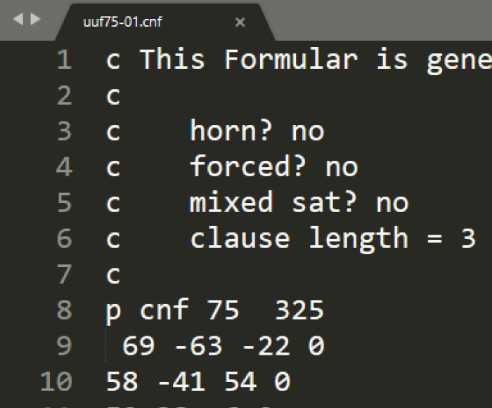

**Implémentation d'un SOLVEUR 3-SAT Projet du Module "Bio-Inspired Computing" M2-S1 ISII Fac Centrale.**

**Le problème 3-SAT (satisfaisabilité sur trois littéraux) est un problème de décision qui appartient à la classe de complexité NP-Complet.**

 **`Dataset utilisé : DIMACS CNF`**
**Il est composé de 100 fichiers, chaque fichier contient 75 variables et 325 clauses où chaque clause a une longueur égale à 3.**

**`Exemple d'un fichier CNF`**

 **Le Fichier CNF de la figure correspond à la formule booléenne suivante : 
(x69 ∨ ¬x63 ∨ ¬x22) ∧ (x58 ∨ ¬x41 ∨ x54)**
 
 
 
 
 
 
 
 
 
 
 
 
 **`Méthodes utilisées :`**

- **Méthodes exactes (recherche aveugle)**
  - **La recherche en largeur d’abord (ou BFS, pour Breadth First Search)**
  - **La recherche en profondeur d’abord (ou DFS, pour Depth-First Search)**
  
- **Méthodes heuristiques (recherche informée)**
  - **L'algorithme de recherche A*** ***(avec le nombre de clauses satisfaites comme heuristique)***
  
- **Méthodes métaheuristiques bio-inspirées**
  - **Les algorithmes génétiques (GA, pour Genetic Algorithms)**
  - **L’algorithme de colonies de fourmis (ACS, pour Ant Colony System)**
  
 **`But :`**

**L'objectif du projet est de constater l’explosion combinatoire des méthodes exactes et de s’initier aux méthodes heuristiques et métaheuristiques qui représentent des
approches incontournables pour la résolution des problèmes complexes.**

**`Rapport détaillé du projet "Implémentation d'un SOLVEUR 3-SAT"`**
***Cliquer sur l'image pour consulter le rapport :)***

**`Présentation du projet "Implémentation d'un SOLVEUR 3-SAT"`**
***Cliquer sur l'image pour consulter la présentation :)***

